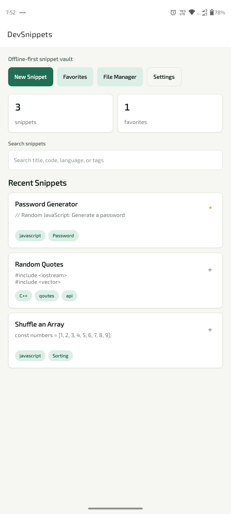
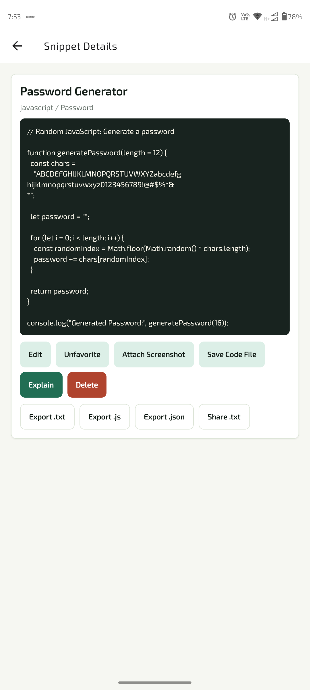
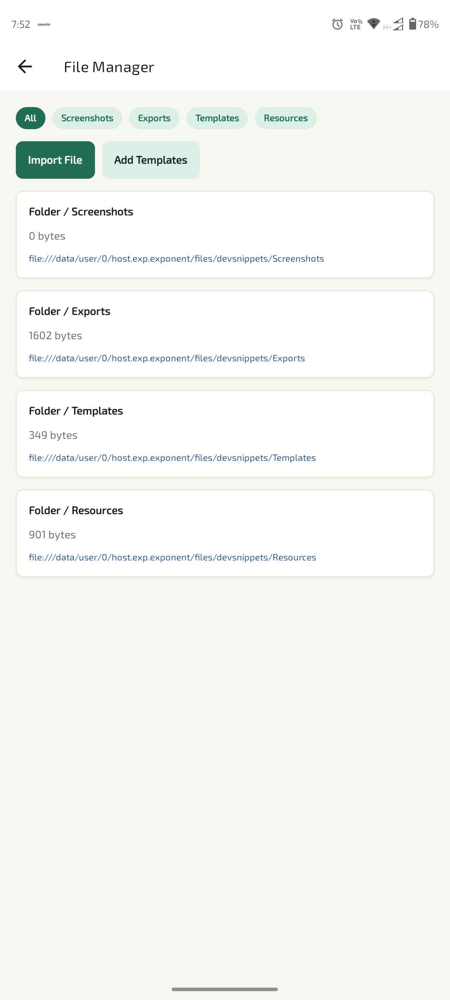
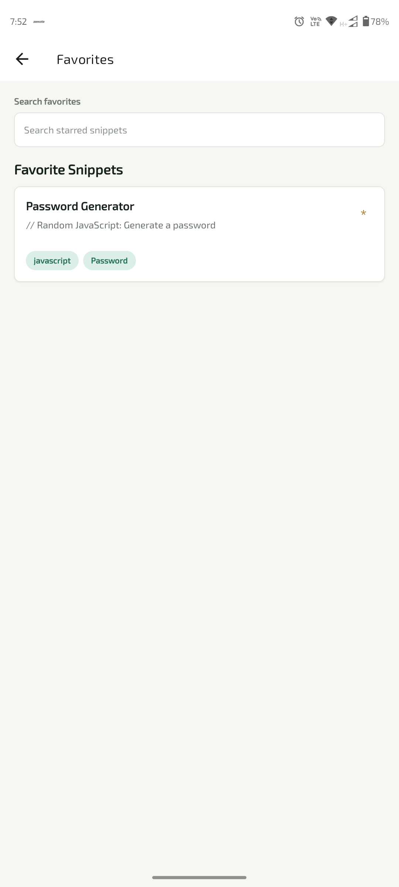
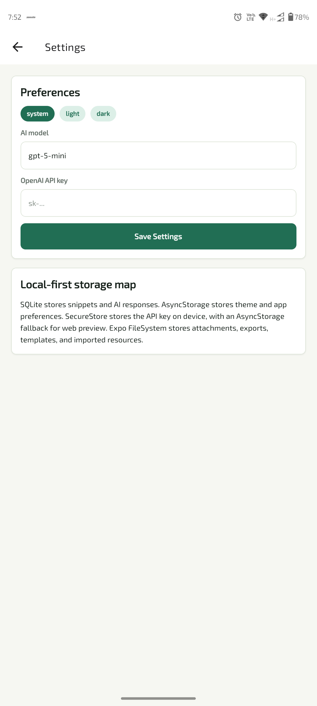

# DevSnippets AI

An offline-first code snippet vault for mobile with AI-powered explanations. Store, organize, and understand your code snippets on the go.

## Features

✨ **Offline-First Architecture** - All snippets stored locally on your device with SQLite, accessible anywhere without internet

🤖 **AI-Powered Explanations** - Get instant explanations of your code using OpenAI API with customizable models

🏷️ **Smart Organization** - Tag and search snippets across title, code, language, and tags

❤️ **Favorites** - Mark important snippets as favorites for quick access

📁 **File Manager** - Manage attachments and resources directly from the app with support for multiple folders:
  - Screenshots
  - Exports
  - Templates
  - Resources

🎨 **Beautiful UI** - Glass-morphism design with light/dark theme support

📱 **Cross-Platform** - Built with Expo and React Native - runs on iOS, Android, and Web

💾 **Multiple Export Formats** - Export snippets as TXT, JS, or JSON

🔒 **Secure Storage** - Sensitive data protected with expo-secure-store

## Tech Stack

- **Framework**: Expo 55 with TypeScript
- **Navigation**: Expo Router
- **Database**: SQLite (expo-sqlite)
- **Storage**: Async Storage + Secure Store
- **AI**: OpenAI API integration
- **UI**: Custom React Native components with glass-effect styling
- **Build Tools**: Metro bundler with ESLint

## Screenshots

<div style="display: flex; flex-wrap: wrap; gap: 16px; justify-content: center;">
  <div style="flex: 1; min-width: 200px; text-align: center;">
    <h4>Home Page</h4>
    
  </div>
  <div style="flex: 1; min-width: 200px; text-align: center;">
    <h4>Create/Edit Snippet</h4>
    
  </div>
  <div style="flex: 1; min-width: 200px; text-align: center;">
    <h4>File Manager</h4>
    
  </div>
  <div style="flex: 1; min-width: 200px; text-align: center;">
    <h4>Favorites</h4>
    
  </div>
  <div style="flex: 1; min-width: 200px; text-align: center;">
    <h4>Settings</h4>
    
  </div>
</div>

## Project Structure

```
src/
├── app/                          # Expo Router screens
│   ├── _layout.tsx              # Navigation layout
│   ├── index.tsx                # Home/Dashboard
│   ├── create-snippet.tsx       # Create/Edit snippets
│   ├── favorites.tsx            # Favorites view
│   ├── files.tsx                # File manager
│   ├── settings.tsx             # Settings & preferences
│   └── snippet/[id].tsx         # Individual snippet view
├── components/
│   ├── ui.tsx                   # Reusable UI components
│   └── snippets/
│       ├── empty-state.tsx      # Empty state display
│       ├── snippet-card.tsx     # Snippet card component
│       └── snippet-form.tsx     # Form for creating/editing
├── lib/
│   ├── ai.ts                    # OpenAI API integration
│   ├── file-store.ts            # File system operations
│   ├── preferences.ts           # User preferences
│   └── snippet-store.ts         # SQLite operations
└── types/
    └── snippet.ts               # TypeScript type definitions
```

## Data Model

### Snippet
```typescript
type Snippet = {
  id: number;
  title: string;
  code: string;
  language: string;
  tags: string[];
  isFavorite: boolean;
  aiResponse: string | null;
  attachments: string[];
  createdAt: number;
  updatedAt: number;
};
```

## Getting Started

### Prerequisites
- Node.js 18+
- npm or yarn
- Expo CLI (optional, can use npm/yarn)

### Installation

```bash
# Clone the repository
git clone <repository-url>
cd devsnippets-ai

# Install dependencies
npm install

# Start the development server
npm start
```

### Running on Different Platforms

```bash
# Android
npm run android

# iOS
npm run ios

# Web
npm run web
```

## Configuration

### API Keys
To use AI-powered explanations, add your OpenAI API key in the Settings screen within the app.

### Theme
The app automatically adapts to system theme (light/dark) but can be customized in settings.

## Features in Detail

### Home Screen
- Quick view of total snippets and favorites count
- Search snippets by title, code, language, or tags
- Recent snippets list
- Quick navigation to create, favorites, file manager, and settings

### Create/Edit Snippet
- Add new code snippets with title, code, language, and tags
- Edit existing snippets
- Request AI explanation if API key is configured
- Add file attachments

### Favorites
- View all marked favorite snippets
- Quick access to frequently used code

### File Manager
- Browse organized file structure
- Manage attachments and resources
- Support for Screenshots, Exports, Templates, and Resources folders

### Settings
- Configure OpenAI API key and model selection
- Theme preference (System, Light, Dark)
- View app information

### Individual Snippet View
- Full code display with syntax highlighting
- View AI explanation if available
- Toggle favorite status
- Edit or delete snippets
- Export in multiple formats

## Available Scripts

```bash
npm start          # Start development server
npm run android    # Run on Android device/emulator
npm run ios        # Run on iOS device/simulator
npm run web        # Run web version
npm run lint       # Run ESLint
npm run reset-project  # Reset to clean state
```

## Contributing

Contributions are welcome! Please feel free to submit a Pull Request.

## License

This project is open source and available under the MIT License.

## Support

For issues, questions, or suggestions, please open an issue on the repository.

---

Built with ❤️ using Expo and React Native
